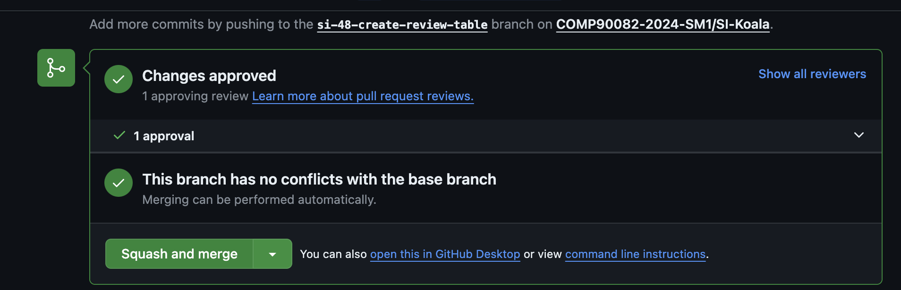
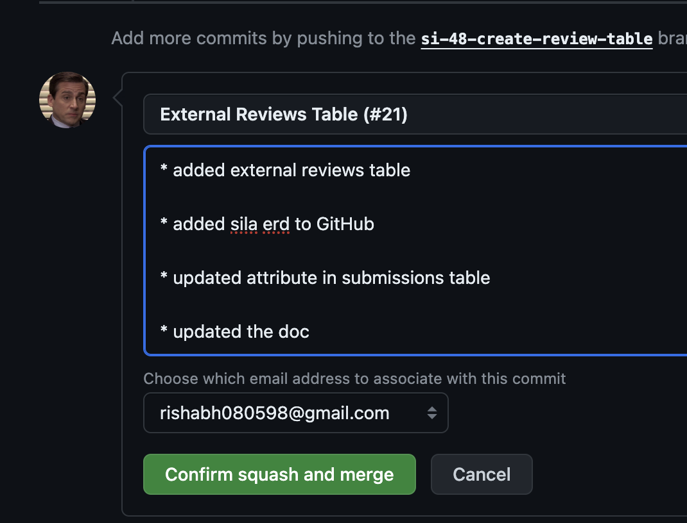
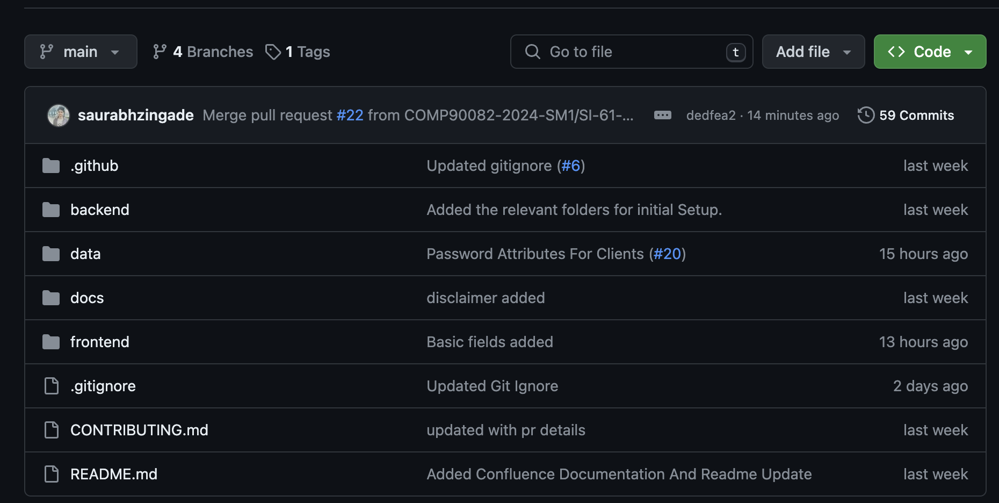
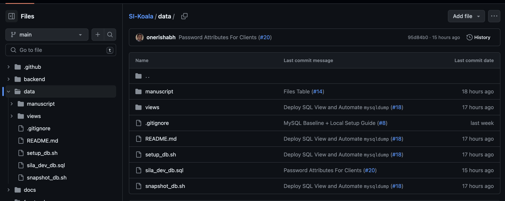

# Contributing Guide

Due to the limitation of the GitHub plan at The University of Melbourne, certain rules can't be enforced explicitly and hence we expect developers to honor the rules of this contribution guide to have efficient collaboration with minimal distribution during the project SDLC.

## Overview
- [How To Understand Everything?](#how-to-understand-everything)
  - [Feeling overwhelmed by everything in this codebase?](#feeling-overwhelmed-by-everything-in-this-codebase)
- [Branch Protection](#branch-protection)
- [Branch Naming Convention and Commit Convention](#branch-naming-convention-and-commit-convention)
- [Pull Requests](#pull-requests)
- [Guide After Approval](#guide-after-approval)

## How To Understand Everything?
### Feeling overwhelmed by everything in this codebase?

1. This application on the highest level is built out as a three tier web application - Frontend, Backend, and Database. This allows us to develop independently and iteratively, without breaking changes.
    - If you are a frontend developer, then reading [frontend/README.md](frontend/README.md) will be good start.
    - If you are a backend developer, then reading [backend/README.md](backend/README.md) will be good start.
    - If you are a data person, then reading [data/README.md](data/README.md) will be good start.
2. Once you understand how the core application works (`frontend/`, `backend/`, `data/`), have a read about AWS at [aws/README.md](aws/README.md)
3. Once you understand the core application + the platform (AWS), read about GitHub Actions Workflows at [.github/workflows/README.md](.github/workflows/README.md)
4. Lastly, don't be this guy. 

## Branch Protection
- `main` is a protected branch and any changes into `main` should be pushed as a pull request (PR) from a feature branch. 
- All PR's into `main` should have at least one approver which is not the original author of the PR. 
- All PR's merging into `main` should be merged using the `squash` strategy.
- All PR's post approval should be merged by the author of the PR only.

Useful Links:
- What is [Squash & Merge strategy](https://docs.github.com/en/pull-requests/collaborating-with-pull-requests/incorporating-changes-from-a-pull-request/about-pull-request-merges#squash-and-merge-your-commits)?
- Why do we need [branch protection](https://blog.mergify.com/github-branch-protection-what-it-is-and-why-it-matters/)?

## Branch Naming Convention and Commit Convention
- {{ jira-issue-key }}-short-desc-or-jira-issue-title
- bugfix/{{ jira-issue-key }}-short-desc-or-jira-issue-title
- hotfix/{{ jira-issue-key }}-short-desc-or-jira-issue-title
- release/{{ jira-epic/user_story-key }}-short-desc-or-jira-epic/user_story-title
- Make sure that your commits are organised in a logical way grouping similar changing together and providding descriptive but short messages to capture changes. 

Please make sure that every pull request is traceable back to jira issues.

## Pull Requests
- Please make sure PR's have descriptive titles.
- Please make sure PR's have enough details in them. 
- Refer [pull_request_template](.github/pull_request_template.md) for more details.

## Guide After Approval
- Use Squash and Merge and delete the branch after the merge is done.
- Make sure that the PR title comes in the merge commit like this
  
- If you don't add that the final merge in the `main` branch looks like

- However, if your merge commit contains the the PR title and the PR number, you see something like this which makes tracing easier.

