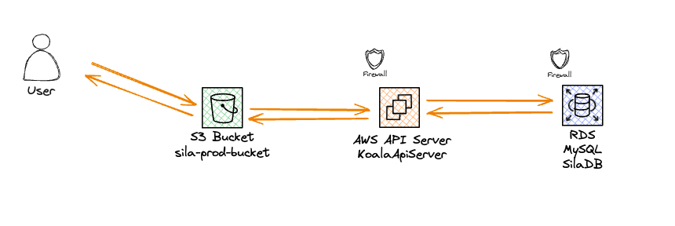

# Welcome to SiLA AWS CDK Python Project

This is the AWS CDK codebase which is used to deploy the infrastructure on which SiLA Manuscript Submission runs on. 

## Table of Contents
- [Pre-Requisites](#pre-requisites)
    - [Software](#software)
    - [Process](#process)
- [Platform Overview](#platform-overview)
    - [Frontend](#frontend)
    - [Backend](#backend)
    - [Database](#database)

## Pre-Requisites

### Software
- Install aws cli in your machine [refer](https://docs.aws.amazon.com/cli/latest/userguide/getting-started-install.html).
- Create a python virtual environment using `python -m venv .venv` in the `aws`.
- Install required python packages using `pip install -r requirements.txt requirements-dev.txt`.
- Create a `aws/.env` file which is of below format and source it like `source aws/.env`
    ```
    export AWS_ACCESS_KEY_ID=your-access-key
    export AWS_SECRET_ACCESS_KEY=your-secret-access-key
    export AWS_DEFAULT_REGION=ap-southeast-2
    ```
    - Create your access key and secret key using AWS Console [refer](https://docs.aws.amazon.com/IAM/latest/UserGuide/id_credentials_access-keys.html#Using_CreateAccessKey).

### Process
- `cdk diff` can be used be used to see what changes to the platform does your code make. Make a PR to main to get those changes deployed to AWS.
- `cdk deploy` is used to deploy the infrastructure.

## Platform Overview
SiLA manuscript submission is deployed using the standard [Three-Tier Architecture Pattern](https://medium.com/@shrestha.matina.20/what-is-the-3-tier-architecture-4520522e0720). In this pattern, presentation (frontend), application (backend), and database (data) are decoupled for maximum flexibility and security.



### Frontend
The frontend modules are built (`npm run build`) and webpack is uploaded to an AWS S3 bucket for users to interact with.

### Backend
The api server is hosted on an AWS EC2 t2.micro server running Linux. The server has node installed in it and any further secrets needed injected into the env variables. 

### Database
AWS RDS running `db.t3.micro` and MySQL version `8.0.31` is used. The schemas available in the database are available in the `data/` folder. 
